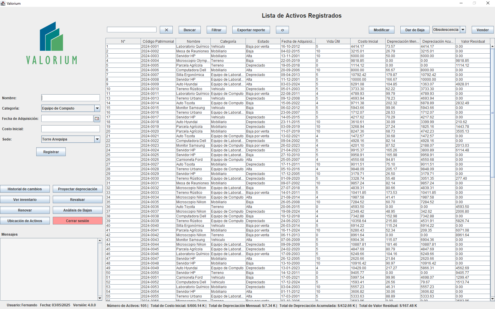

# Valorium – Sistema de Depreciación de Activos Fijos

**Versión:** 4.0.0  
**Fecha:** Diciembre 2024

> Valorium nace del concepto de “valor” y ofrece una solución integral para gestionar el ciclo de vida de los activos fijos en la Universidad Tecnológica del Perú, registrando altas, bajas, ventas, revaluaciones y renovaciones, calculando depreciaciones y generando reportes detallados.

## Tabla de Contenidos
1. [Características](#características)  
2. [Requisitos](#requisitos)  
3. [Instalación](#instalación)  
4. [Uso Rápido](#uso-rápido)  
5. [Consideraciones](#consideraciones)  
6. [Limitaciones](#limitaciones)  
7. [Capturas de Pantalla](#capturas-de-pantalla)  
8. [Contribuir](#contribuir)
9. [Agradecimientos](#agradecimientos)
10. [Licencia](#licencia) 

## Características
- **Registro de Activos**: alta de computadoras, mobiliario, laboratorios, vehículos y edificios.  
- **Cálculo de Depreciación**: línea recta mensual y anual.  
- **Valor Residual**: cálculo automático según depreciación acumulada.  
- **Reportes**: exportación a Excel y gráficos interactivos de inventario y pérdidas por categoría.  
- **Notificaciones**: alertas para revisión periódica y proximidad al fin de vida útil (< 6 meses).  
- **Gestión Avanzada**: búsqueda, filtrado, ordenamiento, modificaciones, bajas, ventas, revaluaciones y renovaciones con historial completo.  
- **Tecnologías**: Java Swing, JDBC (MySQL), Apache POI para Excel.

## Requisitos
- Java 11 o superior  
- MySQL 5.7+  
- Apache NetBeans 22 (o IDE compatible)  
- Biblioteca Apache POI (para exportación a Excel)

## Instalación
1. Clona el repositorio:  
   ```
   git clone https://github.com/Ferinjoque/valorium.git
   cd valorium
   ```
2. Crea la base de datos e importa el script:
   ```
   CREATE DATABASE valorium;
   USE valorium;
   SOURCE valorium_db.sql;
   ```
3. Configura credenciales en `util/ConexionBD.java`.
4. Compila y ejecuta:
   ```
   mvn clean package
   java -jar target/valorium-1.0.jar
   ```

## Uso Rápido
1. Ejecuta la clase `controlador.Main`.
2. Inicia sesión con un usuario válido.
3. Registra un activo nuevo desde la pestaña “Registrar”.
4. Visualiza, modifica o da de baja activos; genera reportes o proyecta depreciaciones desde la interfaz.

## Consideraciones
- La vida útil y categorías están predefinidas según normas SUNAT.
- El formato de fecha es `dd-MM-yyyy`.
- Los terrenos no se deprecian (vida útil = 0). 

## Limitaciones
- Sin autenticación multifactor ni roles personalizados.
- No contempla integración con otros sistemas UTP.
- Renovaciones y revaluaciones manuales sin valoración externa automática.

## Capturas de Pantalla


## Contribuir
1. Haz un fork y crea una rama (`git checkout -b feature/mi-mejora`).
2. Realiza tus cambios y haz commit (`git commit -m "Añade función X"`).
3. Envía un pull request a main.

## Agradecimientos
- **Equipo de desarrollo**: Rosa Quispe, Constantino Ramirez y Axel Ramirez.

## Licencia
Este proyecto está bajo la GNU General Public License v3.0.
